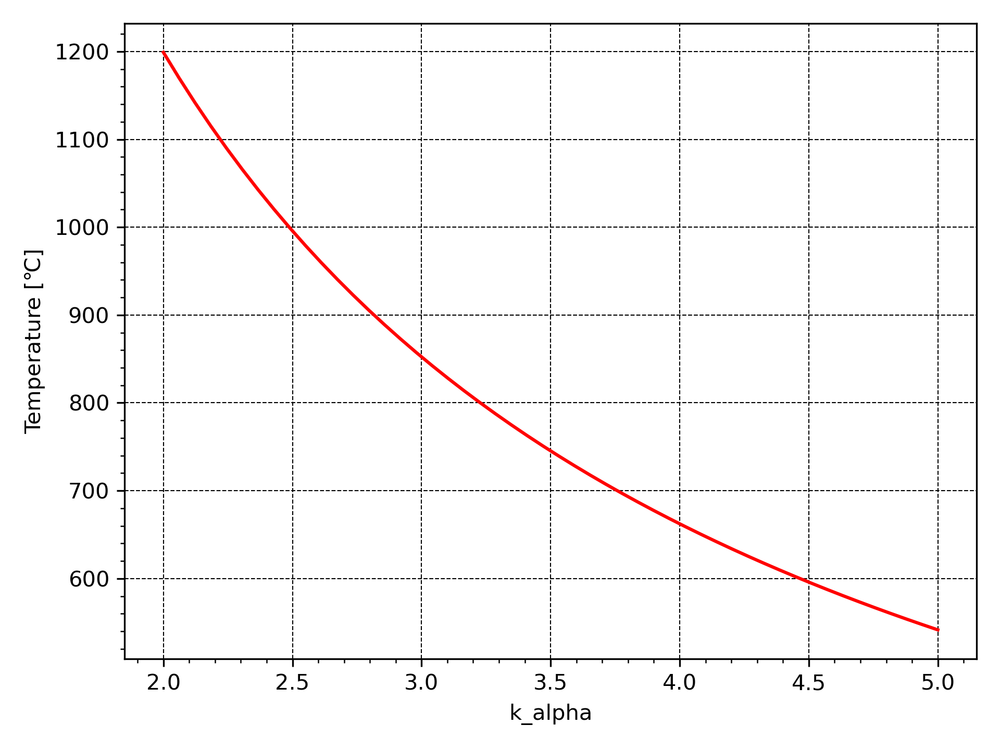

# Calculation of fuel combustion processes in the combustion chamber of a gas turbine engine
Program for calculating the fuel combustion process in the combustion chambers of gas turbine plants

The program is based on the liquid properties library `pyfluids`.

### Units
- temperature - degree Celsius _(°C)_;
- absolute pressure _(Pa)_

## Variables
- `fluid` - name of gas (class instance `FluidList`)
- `mol_mass` - molar mass [kg/mol]
- `mol` - mole fraction
- `mass` - mass fraction

## Initial data
The fractional composition of the fuel is specified 
in the form of a dictionary. Key - faction name (str). Properties tuple:
- `fluid`
- `mol`
- volumetric heat of combustion at 0 deg. C [J/m3]


## Calorimetric fuel combustion temperature calculation

```python
from combustion.combust import Combust
from scipy import constants as cst
from pyfluids import FluidsList

fuel = {
        'CH4': (FluidsList.Methane, .98, 35800000.),
        'C2H6': (FluidsList.Ethane, .0, 61300000.),
        'C3H8': (FluidsList.Propyne, .009, 91300000.),
        'C4H10': (FluidsList.Butene, .008, 118500000.),
        'C5H12': (FluidsList.CycloPentane, .0, 146500000.),
        'CO2': (FluidsList.CarbonDioxide, .0, .0),
        'N2': (FluidsList.Nitrogen, .003, .0),
        'O2': (FluidsList.Oxygen, .0, .0),
        'H2S': (FluidsList.SulfurDioxide, .0, 23400000.),
        'H2O': (FluidsList.Water, .0, .0),
        'H2': (FluidsList.Hydrogen, .0, 10800000.),
        }

# Calorimetric fuel combustion temperature calculation
comb = Combust(fluid=fuel)
temp = comb._burnTemp(k_alpha=1.3, temp_air=300, pressure=cst.atm)
print(f"Calorimetric fuel combustion temperature {temp:.0f} \u2103")
print("Gas composition:\n", comb.gas)
```

# Calculation of excess air coefficient
```python
k_alpha = comb.burnAlpha(temp_gas=950, temp_air=300, pressure=cst.atm)
print(f'Excess air ratio {k_alpha:0.3f}')
print("Gas composition:\n", comb.gas)
```

# Plotting a graph of the dependence of calorimetric temperature on the excess air coefficient
```python
comb.tempAlphaPl(k_alpha=(2, 5))
```


## About the author
Sergey Besedin, dr. of sc., prof.

Konstantin Parfyonov, engineer
